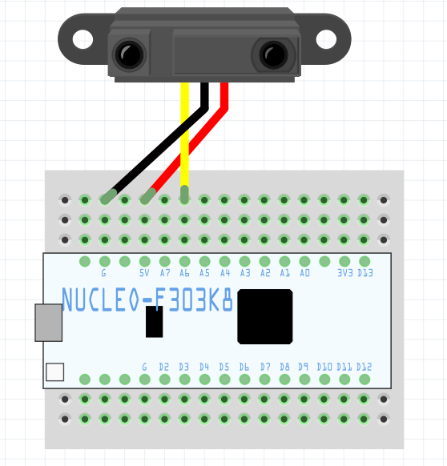

# nucleo-GP2Y0A21YK
Sample to run GP2Y0A21YK using Nucleo.

## Requirements
* STM32 Nucleo Board
  * STM32F303K8
* Sensor
  * GP2Y0A21YK

## Wiring


## Tips
### How to check the sensor value on Mac
1, Check your modem port
```
$ ls /dev/tty.usbmodem*
```

2, Connect your modem port
```
$ screen [your modem port]
```

3, Finish screen command
```
Ctr+a & Ctr+\
```
